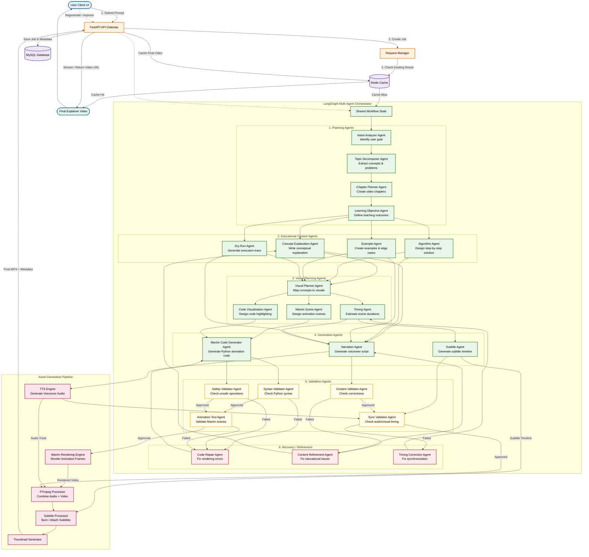

```mermaid
graph TD

    %% =========================
    %% STYLING
    %% =========================
    classDef client fill:#E3F2FD,stroke:#1565C0,stroke-width:2px,color:#000;
    classDef gateway fill:#FFF3E0,stroke:#EF6C00,stroke-width:2px,color:#000;
    classDef storage fill:#EDE7F6,stroke:#5E35B1,stroke-width:2px,color:#000;
    classDef agent fill:#E8F5E9,stroke:#2E7D32,stroke-width:2px,color:#000;
    classDef validation fill:#FFFDE7,stroke:#F9A825,stroke-width:2px,color:#000;
    classDef engine fill:#FCE4EC,stroke:#C2185B,stroke-width:2px,color:#000;
    classDef output fill:#E0F2F1,stroke:#00695C,stroke-width:2px,color:#000;
    classDef error fill:#FFEBEE,stroke:#C62828,stroke-width:2px,color:#000;

    %% =========================
    %% CLIENT LAYER
    %% =========================
    User([User Client UI]):::client
    VideoPlayer([Final Explainer Video]):::output

    %% =========================
    %% API / BACKEND
    %% =========================
    FastAPI[FastAPI API Gateway]:::gateway
    Request[Request Manager]:::gateway
    Cache[(Redis Cache)]:::storage
    MySQL[(MySQL Database)]:::storage

    %% =========================
    %% LANGGRAPH ORCHESTRATOR
    %% =========================
    subgraph LangGraph["LangGraph Multi-Agent Orchestrator"]

        State["Shared Workflow State"]:::agent

        subgraph Planning["1. Planning Agents"]
            Intent[Intent Analyzer Agent<br/>Identify user goal]:::agent
            Topic[Topic Decomposer Agent<br/>Extract concepts & problems]:::agent
            Structure[Chapter Planner Agent<br/>Create video chapters]:::agent
            Learning[Learning Objective Agent<br/>Define teaching outcomes]:::agent
        end

        subgraph Content["2. Educational Content Agents"]
            Concept[Concept Explanation Agent<br/>Write conceptual explanation]:::agent
            Algorithm[Algorithm Agent<br/>Design step-by-step solution]:::agent
            Example[Example Agent<br/>Create examples & edge cases]:::agent
            DryRun[Dry Run Agent<br/>Generate execution trace]:::agent
        end

        subgraph Visual["3. Visual Planning Agents"]
            VisualPlanner[Visual Planner Agent<br/>Map concepts to visuals]:::agent
            ManimPlanner[Manim Scene Agent<br/>Design animation scenes]:::agent
            CodeVisual[Code Visualization Agent<br/>Design code highlighting]:::agent
            Timing[Timing Agent<br/>Estimate scene durations]:::agent
        end

        subgraph Generation["4. Generation Agents"]
            Script[Manim Code Generator Agent<br/>Generate Python animation code]:::agent
            Narration[Narration Agent<br/>Generate voiceover script]:::agent
            Subtitle[Subtitle Agent<br/>Generate subtitle timeline]:::agent
        end

        subgraph Quality["5. Validation Agents"]
            Syntax[Syntax Validator Agent<br/>Check Python syntax]:::validation
            Safety[Safety Validator Agent<br/>Check unsafe operations]:::validation
            VisualTest[Animation Test Agent<br/>Validate Manim scenes]:::validation
            ContentTest[Content Validator Agent<br/>Check correctness]:::validation
            SyncTest[Sync Validator Agent<br/>Check audio/visual timing]:::validation
        end

        subgraph Recovery["6. Recovery / Refinement"]
            CodeFix[Code Repair Agent<br/>Fix rendering errors]:::error
            ContentFix[Content Refinement Agent<br/>Fix educational issues]:::error
            TimingFix[Timing Correction Agent<br/>Fix synchronization]:::error
        end
    end

    %% =========================
    %% ASSET GENERATION PIPELINE
    %% =========================
    subgraph Execution["Asset Generation Pipeline"]

        TTS[TTS Engine<br/>Generate Voiceover Audio]:::engine
        Manim[Manim Rendering Engine<br/>Render Animation Frames]:::engine
        FFmpeg[FFmpeg Processor<br/>Combine Audio + Video]:::engine
        Subtitles[Subtitle Processor<br/>Burn / Attach Subtitles]:::engine
        Thumbnail[Thumbnail Generator]:::engine
    end

    %% =========================
    %% INPUT FLOW
    %% =========================
    User -->|1. Submit Prompt| FastAPI
    FastAPI -->|2. Create Job| Request
    Request -->|3. Check Existing Result| Cache

    Cache -->|Cache Hit| VideoPlayer
    Cache -->|Cache Miss| State

    %% =========================
    %% PLANNING FLOW
    %% =========================
    State --> Intent
    Intent --> Topic
    Topic --> Structure
    Structure --> Learning

    Learning --> Concept
    Learning --> Algorithm
    Learning --> Example
    Learning --> DryRun

    %% =========================
    %% CONTENT → VISUAL FLOW
    %% =========================
    Concept --> VisualPlanner
    Algorithm --> VisualPlanner
    Example --> VisualPlanner
    DryRun --> VisualPlanner

    VisualPlanner --> ManimPlanner
    VisualPlanner --> CodeVisual
    VisualPlanner --> Timing

    %% =========================
    %% GENERATION FLOW
    %% =========================
    ManimPlanner --> Script
    CodeVisual --> Script

    Concept --> Narration
    Algorithm --> Narration
    Example --> Narration
    DryRun --> Narration

    Timing --> Narration
    Timing --> Subtitle

    Script --> Syntax
    Script --> Safety

    Narration --> ContentTest
    Subtitle --> SyncTest

    %% =========================
    %% VALIDATION FLOW
    %% =========================
    Syntax -->|Approved| VisualTest
    Syntax -->|Failed| CodeFix

    Safety -->|Approved| VisualTest
    Safety -->|Failed| CodeFix

    ContentTest -->|Approved| SyncTest
    ContentTest -->|Failed| ContentFix

    VisualTest -->|Approved| Manim
    VisualTest -->|Failed| CodeFix

    CodeFix --> Script
    ContentFix --> Narration
    ContentFix --> Concept
    TimingFix --> Timing

    %% =========================
    %% AUDIO / VIDEO GENERATION
    %% =========================
    Narration --> TTS
    TTS --> SyncTest

    Manim -->|Rendered Video| FFmpeg
    TTS -->|Audio Track| FFmpeg
    Subtitle -->|Subtitle Timeline| Subtitles

    SyncTest -->|Approved| FFmpeg
    SyncTest -->|Failed| TimingFix

    %% =========================
    %% FINAL ASSET PROCESSING
    %% =========================
    FFmpeg --> Subtitles
    Subtitles --> Thumbnail

    Thumbnail -->|Final MP4 + Metadata| FastAPI

    %% =========================
    %% PERSISTENCE
    %% =========================
    FastAPI -->|Save Job & Metadata| MySQL
    FastAPI -->|Cache Final Video| Cache

    %% =========================
    %% FINAL RESPONSE
    %% =========================
    FastAPI -->|Stream / Return Video URL| VideoPlayer
    VideoPlayer --> User

    %% =========================
    %% FEEDBACK / ITERATION
    %% =========================
    User -.->|Regenerate / Improve| FastAPI
    FastAPI -.-> State
```