# Didactics — System Architecture

```mermaid
graph TB
    classDef user fill:#E3F2FD,stroke:#1565C0,stroke-width:2px,color:#000;
    classDef api fill:#FFF3E0,stroke:#EF6C00,stroke-width:2px,color:#000;
    classDef orchestrator fill:#E8EAF6,stroke:#3949AB,stroke-width:2px,color:#000;
    classDef agent fill:#E8F5E9,stroke:#2E7D32,stroke-width:2px,color:#000;
    classDef artifact fill:#F3E5F5,stroke:#7B1FA2,stroke-width:2px,color:#000;
    classDef validator fill:#FFF8E1,stroke:#F9A825,stroke-width:2px,color:#000;
    classDef tool fill:#FCE4EC,stroke:#C2185B,stroke-width:2px,color:#000;
    classDef storage fill:#ECEFF1,stroke:#455A64,stroke-width:2px,color:#000;
    classDef note fill:#FAFAFA,stroke:#757575,stroke-dasharray:5 5,color:#333;

    User([Learner / User]):::user

    subgraph API["Application Boundary"]
        Gateway[FastAPI API Gateway]:::api
        RequestMgr[Job / Request Manager]:::api
        ResultAPI[Result / Video Delivery API]:::api
    end

    User -->|Natural-language learning request| Gateway
    Gateway --> RequestMgr
    ResultAPI -->|Video URL + metadata + status| User

    subgraph Persistence["Persistence & Caching"]
        Cache[(Redis / Cache)]:::storage
        DB[(MySQL / Persistent Metadata)]:::storage
        ObjectStore[(Rendered Asset Store)]:::storage
    end

    RequestMgr -->|Lookup existing job / cache key| Cache
    Cache -->|Cache hit| ResultAPI
    RequestMgr -->|Create job + initial state| DB
    ResultAPI --> DB
    ResultAPI --> ObjectStore

    subgraph Graph["LangGraph Workflow / Shared State"]
        State[[Workflow State]]:::orchestrator
        Router{Workflow Router}:::orchestrator
        Checkpoint[(Checkpoint / Run State)]:::storage
    end

    RequestMgr -->|Cache miss / new generation job| State
    State --> Router
    State <--> Checkpoint

    subgraph S1["Stage 1 — Request Understanding"]
        Intent[Intent Analyzer Agent\nClassify learning request]:::agent
        Scope[Scope & Requirements Agent\nResolve depth, audience, constraints]:::agent
        ContentMap[Topic / Concept Mapper\nBuild concept inventory]:::agent
    end

    Router --> Intent
    Intent --> Scope
    Scope --> ContentMap
    ContentMap -->|Structured learning specification| State

    subgraph S2["Stage 2 — Pedagogical Planning"]
        Curriculum[Lesson / Chapter Planner\nOrder concepts and dependencies]:::agent
        Objective[Learning Objective Agent\nDefine measurable outcomes]:::agent
        ExamplePlan[Example & Exercise Planner\nSelect demonstrations / edge cases]:::agent
    end

    State --> Curriculum
    State --> Objective
    State --> ExamplePlan
    Curriculum --> Objective
    Objective --> ExamplePlan
    ExamplePlan -->|Lesson plan + examples + objectives| State

    subgraph S3["Stage 3 — Educational Content"]
        Explanation[Concept Explanation Agent\nDraft explanatory content]:::agent
        Algorithm[Algorithm / Procedure Agent\nDerive step-by-step procedure]:::agent
        WorkedExample[Worked Example Agent\nGenerate concrete walkthrough]:::agent
        Trace[Execution Trace Agent\nProduce state-by-state trace]:::agent
        ContentArtifact[[Educational Content Artifact]]:::artifact
    end

    State --> Explanation
    State --> Algorithm
    State --> WorkedExample
    State --> Trace
    Explanation --> ContentArtifact
    Algorithm --> ContentArtifact
    WorkedExample --> ContentArtifact
    Trace --> ContentArtifact
    ContentArtifact --> State

    subgraph S4["Stage 4 — Visual & Scene Planning"]
        VisualPlanner[Visual Planner Agent\nMap content to visual representations]:::agent
        ScenePlanner[Scene / Manim Planner\nDefine ordered animation scenes]:::agent
        CodeVisualPlanner[Code Visualization Planner\nDefine highlighting / state changes]:::agent
        TimingPlanner[Timing Planner\nEstimate durations and anchors]:::agent
        Storyboard[[Storyboard + Timing Plan]]:::artifact
    end

    ContentArtifact --> VisualPlanner
    ContentArtifact --> TimingPlanner
    VisualPlanner --> ScenePlanner
    VisualPlanner --> CodeVisualPlanner
    TimingPlanner --> ScenePlanner
    TimingPlanner --> CodeVisualPlanner
    ScenePlanner --> Storyboard
    CodeVisualPlanner --> Storyboard
    Storyboard --> State

    subgraph S5["Stage 5 — Generation"]
        ManimGen[Manim Code Generator Agent\nGenerate deterministic animation script]:::agent
        NarrationGen[Narration Agent\nGenerate voiceover script]:::agent
        SubtitleGen[Subtitle / Caption Planner\nCreate caption segments]:::agent
        GenerationSet[[Code + Narration + Subtitle Artifacts]]:::artifact
    end

    Storyboard --> ManimGen
    ContentArtifact --> NarrationGen
    Storyboard --> NarrationGen
    Storyboard --> SubtitleGen
    NarrationGen --> SubtitleGen
    ManimGen --> GenerationSet
    NarrationGen --> GenerationSet
    SubtitleGen --> GenerationSet
    GenerationSet --> State

    subgraph S6["Stage 6 — Validation Gates"]
        SchemaCheck[Schema / Contract Validator\nValidate structured artifacts]:::validator
        CodeCheck[Python / Manim Static Validator\nCheck syntax and policy]:::validator
        RenderTest[Render Smoke Test\nVerify scenes can execute]:::validator
        ContentCheck[Educational Correctness Validator\nCheck factual / logical consistency]:::validator
        SyncCheck[Audio / Visual Sync Validator\nCheck timing alignment]:::validator
        QualityGate{Quality Gate\nPass / Revise}:::validator
    end

    GenerationSet --> SchemaCheck
    GenerationSet --> CodeCheck
    GenerationSet --> ContentCheck
    CodeCheck --> RenderTest
    SchemaCheck --> QualityGate
    RenderTest --> QualityGate
    ContentCheck --> QualityGate
    GenerationSet --> SyncCheck
    SyncCheck --> QualityGate
    QualityGate -->|Pass| State
    QualityGate -->|Revise| Router

    subgraph Tools["Deterministic Execution & Media Tools"]
        Manim[Manim Renderer]:::tool
        TTS[TTS Engine]:::tool
        FFmpeg[FFmpeg / Media Composer]:::tool
        Captioner[Subtitle / Caption Processor]:::tool
        Thumbnailer[Thumbnail Generator]:::tool
    end

    State -->|Approved animation code| Manim
    State -->|Approved narration text| TTS
    State -->|Approved subtitle timeline| Captioner

    Manim -->|Rendered video| FFmpeg
    TTS -->|Voice audio| FFmpeg
    FFmpeg -->|Base video + audio| Captioner
    Captioner -->|Final subtitled video| Thumbnailer
    Thumbnailer -->|Final MP4 + thumbnail + timing metadata| ObjectStore

    Thumbnailer -->|Completed assets| ResultAPI
    ObjectStore --> ResultAPI
    DB --> ResultAPI
    Cache --> ResultAPI
    ResultAPI -->|Final explainer| User

    User -.->|Regenerate / simplify / expand / fix| Gateway
    Gateway -.->|Update job requirements| State
    State -.->|Targeted revision request| Router

    subgraph LLM["LLM Provider Layer"]
        Gemini[Gemini]
        Groq[Groq]
        OpenAI[OpenAI]
    end

    Intent -.-> LLM
    Scope -.-> LLM
    Curriculum -.-> LLM
    Objective -.-> LLM
    Explanation -.-> LLM
    Algorithm -.-> LLM
    WorkedExample -.-> LLM
    Trace -.-> LLM
    VisualPlanner -.-> LLM
    ScenePlanner -.-> LLM
    CodeVisualPlanner -.-> LLM
    ManimGen -.-> LLM
    NarrationGen -.-> LLM

    Note1["Design rule: an Agent decides or generates.\nDeterministic services validate, render, store, or compose."]:::note
    Note2["Every agent must have a typed input contract,\noutput contract, owner of the output, and failure path."]:::note
    Note3["Shared state stores artifacts and status —\nit is not a dumping ground for arbitrary text."]:::note

    Note1 -.-> Graph
    Note2 -.-> S1
    Note3 -.-> State
```

## Architectural Principles

1. **Do not implement every box as an LLM agent.** Use agents for decisions, synthesis, planning, and generation. Use ordinary code for schema validation, rendering, media composition, storage, caching, and deterministic checks.
2. **Use typed artifact contracts between stages.** A downstream component should consume a stable structure rather than parsing free-form prose from another agent.
3. **Keep LangGraph as the workflow coordinator.** Agents should perform bounded work; the graph should own sequencing, branching, retries, checkpoints, and termination.
4. **Make revision targeted.** A failed render should return to code generation or code repair, not regenerate the entire lesson. A timing failure should update timing/narration/subtitle artifacts without rewriting unrelated content.
5. **Treat the current Intent Analyzer as Stage 1, not as the architecture itself.** Its structured `IntentAnalysis` output is the right direction for a contract-first design.
